# 2021farmpam_v1.1

## maven 총 프로젝트

[Farmpam](https://github.com/hs-keko/Phoenix_Farmpam)

## Project setup

```
npm install
```

### Compiles and hot-reloads for development

```
npm run serve
```

# DB 구성

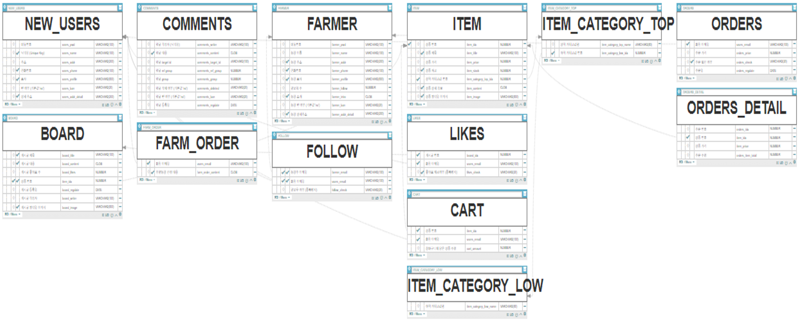

# 디자인 설계

Whimsical 사이트를 사용.

[Farmpam 페이지 디자인 설계](https://whimsical.com/farmpam-UCHNohTTMHwedQQ19xKcjF)
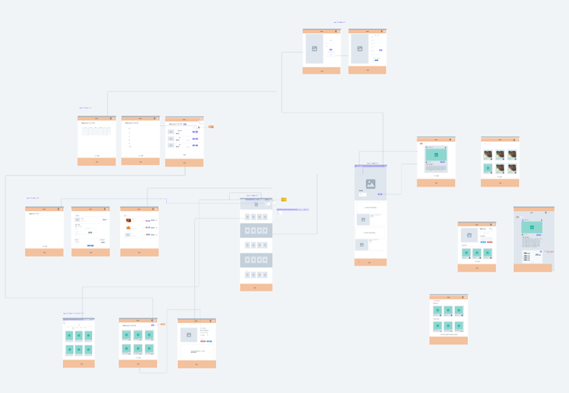

# 페이지 소개

## 메인

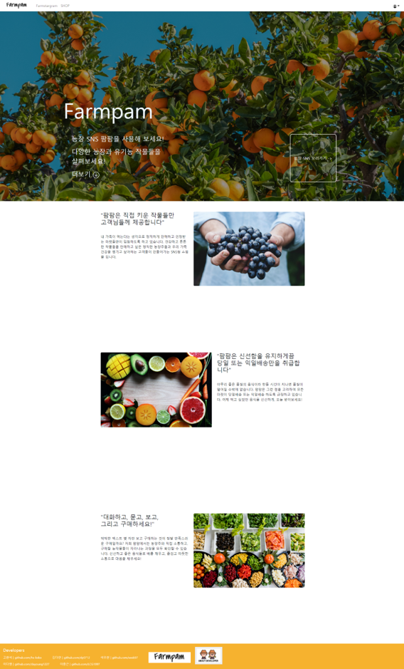

## 로그인/회원가입


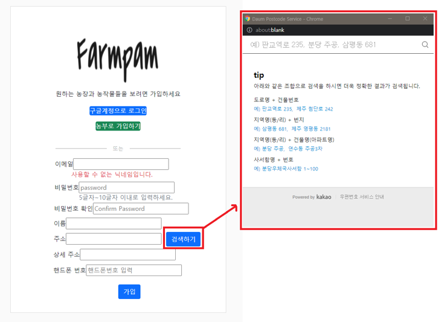

## 쇼핑몰 페이지

## 메인

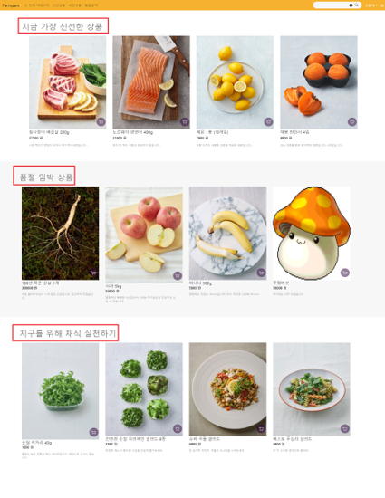

## 이벤트 카테고리

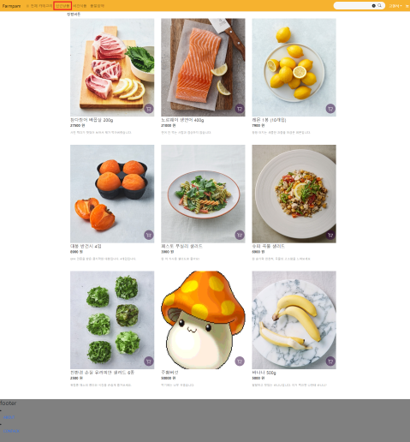

## 카테고리 선택

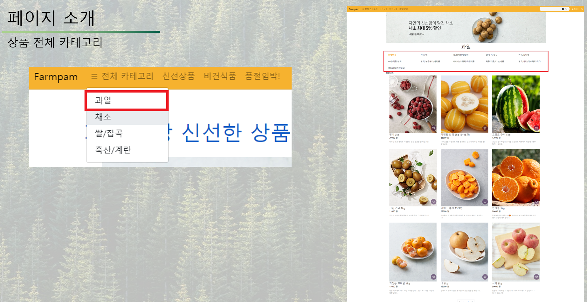

## 상품상세

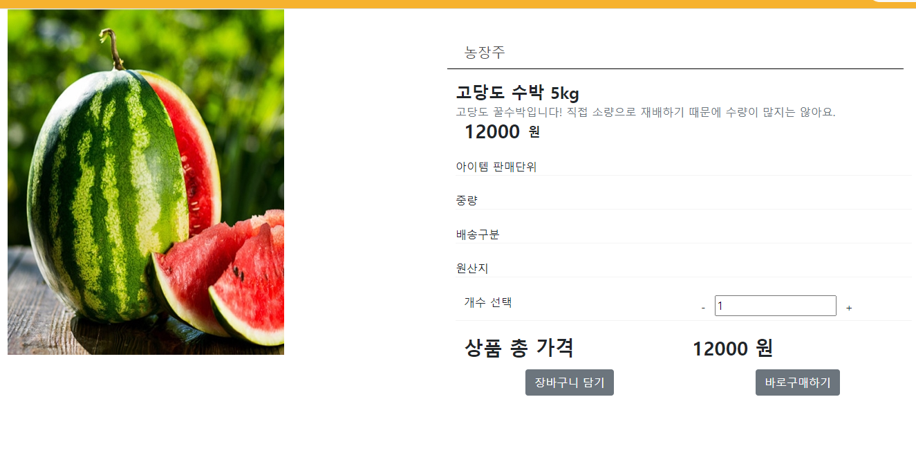

## 판매자 상점

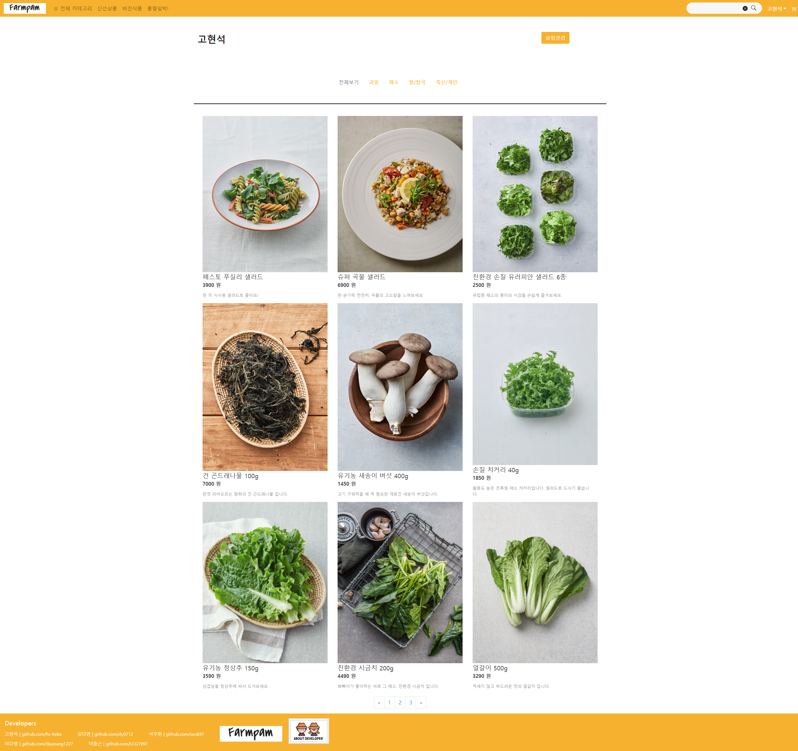

## 내상점 관리

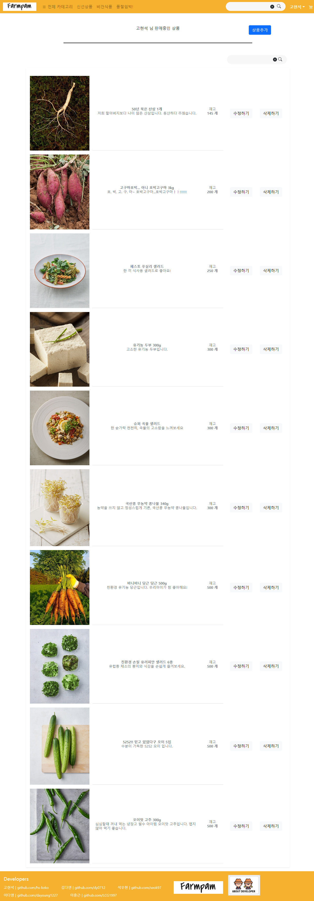

## 장바구니

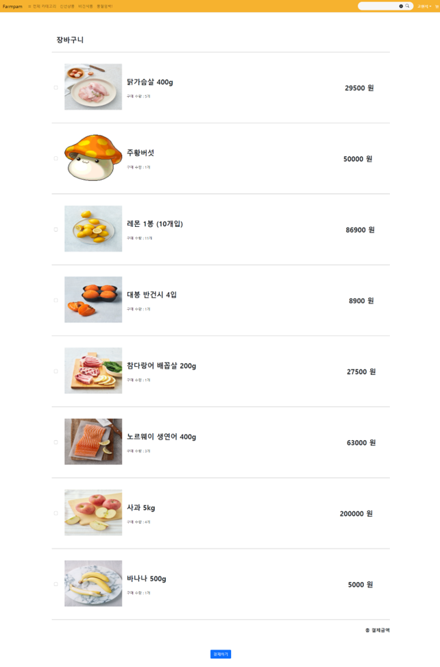

## 상품 저장(올리기)

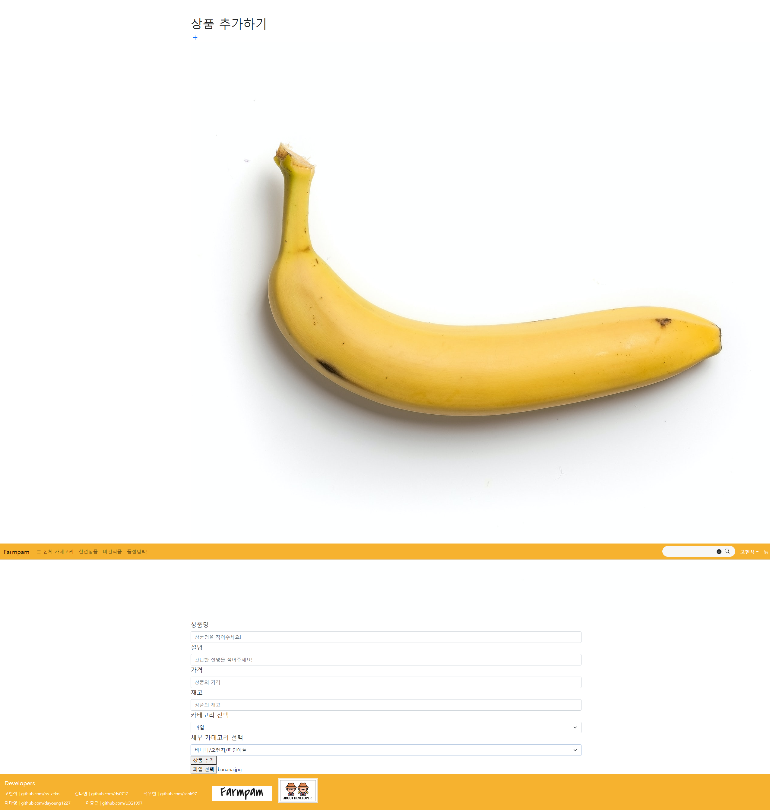
